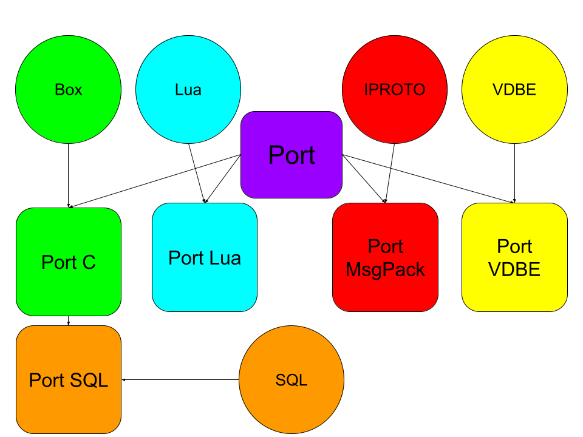
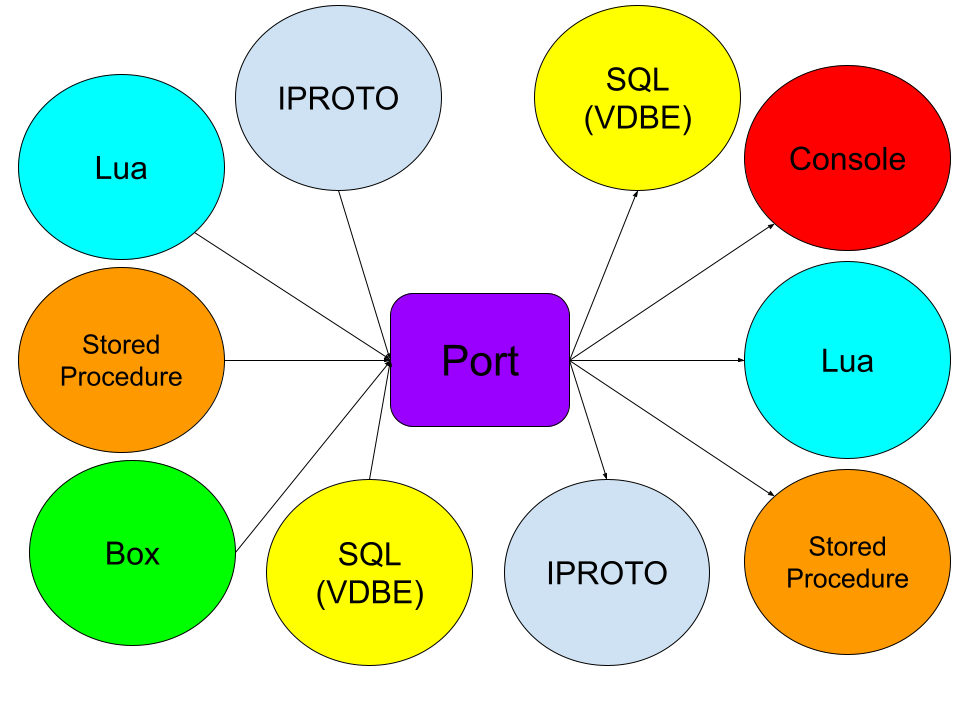

.. vim: ts=4 sw=4 et
.. _ports:

Ports
=====

Introduction
------------

This document provides insights into the concept of ports in Tarantool.

Ports are central to Tarantool's data management and manipulation, serving
as versatile containers for abstract data, including tuples, MsgPack, Lua and
SQL values.

We will explore how ports function and their role in facilitating dataflow
within Tarantool.

General overview
----------------

Ports serve as dynamic and versatile data containers that play a fundamental
role in data management and manipulation within the database. They are designed
to store abstract data of varying types, including MsgPack objects, Lua values,
and more. Here we present a general overview of some of the key requirements of
ports.

**Abstraction of data:**
Ports in Tarantool offer a high level of abstraction, simplifying data
management and interaction. They serve as a unified interface for handling
diverse data types, regardless of their underlying representations. Whether data
arrives in the form of complex MsgPack objects, simple Lua values, or other
structures, ports abstract away the complexities, providing a consistent
means of working with data.

This abstraction is necessary to glue together the various data planes of
Tarantool, including MsgPack, C, Lua, and SQL.

**Dynamic storage:**
Ports are engineered to be dynamic and adaptable. They can efficiently
allocate and resize memory to accommodate data of varying sizes and types. This
dynamic storage allocation ensures that resources are used efficiently,
minimizing unnecessary memory overhead. As data is added or modified within
ports, they intelligently manage memory, optimizing space utilization.

This requirement emerges from the main use case of ports as storage for
various query results, the size of which is not known in advance. "Query" here
is used in a generic sense, meaning `box.select()` as well as function calls and
SQL.

**Data transformation:**
A core function of ports is data transformation. They facilitate the
conversion of data between different representations, allowing seamless
interoperability between internal data structures and external
formats like MsgPack or Lua. This capability is crucial for data serialization,
enabling data to be efficiently transmitted over the network or stored on the
Lua stack.

This feature is an essential part of the dataflow with ports. It enables
converting data coming from various sources to different output formats.

Interface
---------

The base data structure for ports consists of virtual function table and a
padding. The former is required for enabling polymorphism and creating
data plane specific ports via inheritance. The latter is needed for avoiding
dynamic allocations and allowing for creating derived ports from the basic port
on the stack.

..  code:: c

    /* lib/core/port.h */

    struct port {
        const struct port_vtab *vtab;

        char pad[68];
    };

    struct port_vtab {
        int (*dump_msgpack)(struct port *port, struct obuf *out,
                            struct mp_ctx *ctx);

        int (*dump_msgpack_16)(struct port *port, struct obuf *out,
                               struct mp_ctx *ctx);

        void (*dump_lua)(struct port *port, struct lua_State *L, bool is_flat);

        const char *(*dump_plain)(struct port *port, uint32_t *size);

        const char *(*get_msgpack)(struct port *port, uint32_t *size);

        struct Mem *(*get_vdbemem)(struct port *port, uint32_t *size);

        void (*destroy)(struct port *port);
    };

The virtual function table of a port consists of a number of methods for
serializing the port to various output formats and destinations.

The `dump_msgpack` method is used for transforming the port's data to MsgPack
and pushing it to an output buffer for transmission over the network.

In contrast to `dump_msgpack`, the `get_msgpack` method does not involve dynamic
memory allocation for the result, and the result is allocated on the stack or on
the fiber `gc` region. In the former case, the lifetime of the result is tied to
the port's lifetime, while in the latter case the responsibility for managing
the lifetime is handed to the caller. This method of serialization is useful for
processing the arguments and return values of C stored procedures, as well as
arguments of Lua stored procedures created with the `takes_raw_args` option.

The `dump_lua` method facilitates pushing arguments to Lua stored procedures and
retrieving results of different queries ("queries" here again in a generic
sense).

The `dump_plain` method is used to push the port's content to a console
session in a human-readable format like YAML.

Finally, the `get_vdbemem` method allows transforming the port to a VDBE memory
register for storing the result of a stored procedure call in SQL.

Taxonomy of ports
-----------------

To this day, 5 types of ports exist. All ports are based on the `port` structure
discussed above. The SQL port reuses the C port to a large extent, so it is
inherited from the latter.

Each port type is specialized on the source its data comes from. The ports'
structure is tailored to storing data in the most suitable (to minimize the
initial conversions required) and at the same time the most generic way
(for further possible transformation).

The C port (`port_c`) is created when working with internal data
structures or results of C language stored procedures, hence it is adjusted to
store tuples along with raw MsgPack.

The Lua port (`port_lua`) is created for data coming from the Lua world, be it
stored procedures or the application server. It uses a separate Lua stack to
store Lua values.

The MsgPack port (`port_msgpack`) is created for processing IPROTO call (eval)
requests (i.e., RPC). The arguments for procedure call arguments are prepared
using this port type. It is the simplest port of all, plainly storing MsgPack.

The VDBE port (`port_vdbemem`) is used for calling stored procedures from inside
the VDBE. It stores an array of VDBE memory registers.

Last but not least, the SQL port (`port_sql`) is needed for storing the results
of SQL queries and SQL expressions. It stores C port data together with the
original SQL statement needed for retrieving SQL metadata later on.

Dataflow with ports
-------------------

Ports are pivotal to Tarantool's dataflow, acting as intermediaries for data
interaction between various components. The dataflow with ports involves two
essential parts.

**Storage:**
Ports serve as short-term containers for data retrieved from storage
engines (`box.select`), Lua and C stored procedure calls, and data received over
the network.

Consider a scenario where data is fetched from a storage engine. The retrieved
data is stored within ports, preserving its integrity and structure. This
stored data can then be later efficiently transmitted or transformed as needed.

**Serialization:**
When data needs to be transmitted over the network or returned to the Lua stack,
ports are responsible for the serialization of the data. Serialization
involves converting the data into a suitable format, such as MsgPack or Lua.
This transformation is a crucial step in data interchange and storage, ensuring
that data is efficiently represented and can be reconstructed accurately.

Serialization provides a common language for data communication, allowing data
to be seamlessly shared and processed within components.

Imagine a client application sending data (arguments) to Tarantool for a stored
procedure call. Ports serialize this incoming data into an appropriate format,
making it ready for the call.

Complete code walkthrough example
---------------------------------

To consolidate our knowledge about ports, let us have a complete code
walkthrough of a typical port usage involving stored procedures.

Stored procedures can be called locally from Lua as well as remotely from
IPROTO, hence two types of ports are required for preparing the procedure call
arguments, namely, the MsgPack port and the Lua port.

.. code:: c

    /* box/call.c */

    int
    box_process_call(struct call_request *request, struct port *port)
    {
        ...
        struct port args;
	    port_msgpack_create(&args, request->args,
                            request->args_end - request->args);
        ...
    }

    /* box/lua/lbox_func_call.c */

    int
    lbox_func_call(struct lua_State *L)
    {
        ...
        lua_State *args_L = luaT_newthread(tarantool_L);
        if (args_L == NULL)
            return luaT_error(L);
        int coro_ref = luaL_ref(tarantool_L, LUA_REGISTRYINDEX);
        lua_xmove(L, args_L, lua_gettop(L) - 1);
        struct port args;
        port_lua_create(&args, args_L);
        ...
    }

The created port is then passed to a virtual `call` function which dispatches
the procedure call to a language specific handler.

.. code:: c

    /* box/func.c */

    int
    func_call_no_access_check(struct func *base, struct port *args,
                              struct port *ret)
    {
        ...
        int rc = base->vtab->call(base, args, ret);
        ...
    }

Finally, the argument port's contents are dumped to a language specific format.

.. code:: C

    /* box/module_cache.c */

    int
    module_func_call(struct module_func *mf, struct port *args,
             struct port *ret)
    {
        ...
        uint32_t data_sz;
        const char *data = port_get_msgpack(args, &data_sz);
        ...
    }

    /* box/lua/call.c */

    static inline void
    push_lua_args(lua_State *L, struct execute_lua_ctx *ctx)
    {
        if (ctx->takes_raw_args) {
            uint32_t size;
            size_t region_svp = region_used(&fiber()->gc);
            const char *data = port_get_msgpack(ctx->args, &size);
            luamp_push(L, data, data + size);
            region_truncate(&fiber()->gc, region_svp);
        } else {
            port_dump_lua(ctx->args, L, true);
        }
    }

    /* box/sql/func.c */

    int
    func_sql_expr_call(struct func *func, struct port *args, struct port *ret)
    {
        ...
        if (args->vtab != &port_c_vtab || ((struct port_c *)args)->size != 2) {
            diag_set(ClientError, ER_UNSUPPORTED, "Tarantool",
                 "SQL functions");
            return -1;
        }
        struct port_c_entry *pe = ((struct port_c *)args)->first;
        const char *data = pe->mp;
        uint32_t mp_size = pe->mp_size;
        struct tuple_format *format = pe->mp_format;
        ...
    }
