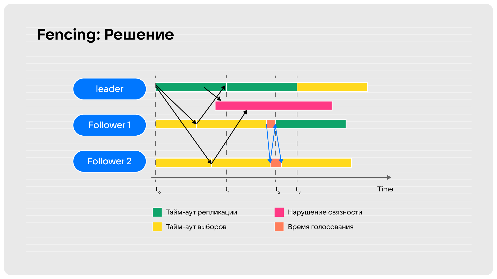

Qsync
=====

Introduction
------------

``Qsync`` stands for quorum-based synchronous replication. Synchronous
transactions are not considered committed and are not responded to a
client until they are replicated onto some number (can be configured
with ``replication_synchro_quorum``) of replicas. Synchronous
replication garantees strong data consistency and reliability.
Tarantool uses Raft consensus algorithm for implementation of
synchronous replication.

Limitations of synchronous replication:
 - Master-slave topology: only one node can act as a master and make
   synchronous transactions;
 - Quorum must be at least 50% of the cluster size + 1: using lower
   value for quorum doesn't give any garantees of synchronous
   replication and leads to unexpected problems, such as split-brain.

How Raft works in general
-------------------------

Raft is a consensus algorithm designed to ensure fault-tolerance and
consistency in distributed systems. The primary goal of the Raft
consensus algorithm is to ensure that a cluster of servers agrees on
a sequence of log entries, representing a shared state machine. In
our case this shared state machine is a replicated database.

Raft achieves consensus by electing a **leader** among the servers in
the cluster. The leader is responsible for accepting client requests,
processing them, and replicating the resulting state changes to other
servers. The other servers in the cluster act as **followers**, which
simply replicate the leader's log entries and respond to client requests
forwarded by the leader.

To maintain consistency, Raft uses a replicated log as the core mechanism.
The leader receives client requests, appends them to its own log, and then
broadcasts the log entries to the followers for replication. Once a majority
of followers acknowledge the receipt and persistence of the log entries,
the leader considers them committed and notifies the followers to apply the
changes to their state machines. This ensures that all replicas eventually
reach the same state.

Raft operates through a series of terms, each consisting of a single
leader election. Terms are time-based and identified by monotonically
increasing numbers. If a leader fails or disconnects, a new leader is
elected in the subsequent term through an election process. The leader
can be elected only if more then half of the nodes voted for him. The
node, which noticed the death of the leader, enters **candidate** state
and starts elections, incrementing term.

Overall, the Raft consensus algorithm provides a clear and understandable
approach to distributed consensus. It simplifies the design and implementation
of distributed systems by providing a fault-tolerant foundation for maintaining
consistency and availability in a cluster of servers.

Unfortunately, Raft consensus works great only in paper, but it's not enough
to just follow specification to ensure cluster operability in case of partial
loss of connection between nodes. Moreover, election time is pretty
significant due to the possibility of an equal number of votes for diffirent
nodes during election process. In order to solve these problemes, Tarantool
applies several tweaks to the canonical implementation of Raft algorithm:
PreVote, Fencing, Split-Vote and Split-Brain detection. They are described in
the following `habr article`_ and `here`_.

Canonical design of Raft can be found in Raft `paper`_, extended version -
in Diego's `dissertation`_. You can also check out the `article`_, which
describes Raft and the specifics of its implementations.

Synchronous replication of the journal
--------------------------------------

The part of Raft consensus algorithm, which is responsible for journal
replication, was implemented as separate task 3 months before the
implementation of election process. So, let's start with describing its
work first.

.. note::
   To refresh memory about network connections architecture lets
   put some marks about ``applier`` and ``relay``.

   When replication starts the replica's applier connects to the master node
   where ``iproto`` thread accepts the connection and creates ``relay``
   thread which monitors every new write to the local WAL via WAL watcher
   and replies to the applier on the master node after processing the data.

   Thus each ``applier`` has a corresponding ``relay`` on the remote node. These
   two entities communicate via two separate sockets and each applier
   and relay has a reader and a writer fibers. Also while each ``relay``
   runs as a separate thread and appliers (not exactly one) run in seperate threads
   (the number of threads is controlled by ``replication_threads`` option).

   For details see :ref:`replication` and ':ref:`relay` internal docs.

Since our WAL engine is **append only** two new records are added:
``IPROTO_CONFIRM`` and ``IPROTO_ROLLBACK``. The first one means
that replicas have successfully written a transaction and we can
continue handling new ones. In turn rollback implies that a quorum
has not been achieved and the transaction should be discarded.

Limbo
~~~~~

Most important structure in ``qsync`` is ``limbo``, which is used to
track synchronous transactions status. Transactions, which are not commited
nor rolled back (it means that they are in progress of collecting ACKs)
are stored here. It is defined as:

.. code-block:: c

    struct txn_limbo {
        /**
         * Queue of limbo entries. Ordered by LSN.
         */
        struct rlist queue;
        /**
         * Number of entries in limbo queue.
         */
        int64_t len;
        /**
         * Instance ID of the owner of all the transactions in the
         * queue.
         */
        uint32_t owner_id;
        /**
         * Condition to wait for completion.
         */
        struct fiber_cond wait_cond;
        /**
         * All components of the vclock are versions of the limbo
         * owner's LSN, how it is visible on other nodes.
         */
        struct vclock vclock;
        /**
         * Latest terms received with PROMOTE entries from remote instances.
         * Limbo uses them to filter out the transactions coming not from the
         * limbo owner.
         */
        struct vclock promote_term_map;
        /**
         * The biggest PROMOTE term seen by the instance and persisted in WAL.
         */
        uint64_t promote_greatest_term;
        /**
         * To order access to the promote data.
         */
        struct latch promote_latch;
        /**
         * Maximal LSN gathered quorum and either already confirmed in WAL, or
         * whose confirmation is in progress right now.
         */
        int64_t confirmed_lsn;
        /**
         * Total number of performed rollbacks. It used as a guard
         * to do some actions assuming all limbo transactions will
         * be confirmed, and to check that there were no rollbacks
         * in the end.
         */
        int64_t rollback_count;
        /**
         * Whether the limbo is in rollback mode.
         */
        bool is_in_rollback;
        /**
         * Savepoint of confirmed LSN. To rollback to in case the current
         * synchro command (promote/demote/...) fails.
         */
        int64_t svp_confirmed_lsn;
        union {
            /**
             * Whether the limbo is frozen. This mode prevents CONFIRMs and
             * ROLLBACKs being written by this instance.
             */
            uint8_t frozen_reasons;
            struct {
                /*
                 * This mode is turned on when quorum is lost if this
                 * instance is the current RAFT leader and fencing is
                 * enabled. Instance leaves this mode when it becomes
                 * leader again or PROMOTE/DEMOTE arrives from some
                 * remote instance.
                 */
                bool is_frozen_due_to_fencing : 1;
                /*
                 * This mode is always on upon node start and is turned
                 * off by any new PROMOTE arriving either via
                 * replication or issued by the node.
                 */
                bool is_frozen_until_promotion : 1;
            };
        };
        /**
         * Whether this instance validates incoming synchro requests. When the
         * setting is on, the instance only allows CONFIRM/ROLLBACK from the
         * limbo owner, tracks PROMOTE/DEMOTE term and owner_id consistency.
         * The filtering is turned off during bootstrap.
         */
        bool do_validate;
    };


Master initiates transaction
~~~~~~~~~~~~~~~~~~~~~~~~~~~~

Let's consider the case where a transaction is initiated on a master
node and replicated to the single replica. Before entering limbo the record
goes via:

.. code-block:: c

    txn_commit
        txn_journal_entry_new

The ``txn_journal_entry_new`` traverse the rows in the record and
if there is a synchronous space modified then we do

.. code-block:: c

    txn_journal_entry_new
        ...
        if (is_sync) {
            txn_set_flags(txn, TXN_WAIT_SYNC | TXN_WAIT_ACK);
        } else if (!txn_limbo_is_empty(&txn_limbo)) {
            txn_set_flags(txn, TXN_WAIT_SYNC);
        }

So we mark the transaction with ``TXN_WAIT_SYNC | TXN_WAIT_ACK``
flags, ie the transaction should wait until previous transactions
are complete and receive ACKs from a quorum.

Note that if the transaction is asynchronous but the limbo queue is
not empty, it means that there are some previous uncommitted synchronous
transactions on the fly, and this asynchronous transaction should wait
for previous synchronous transactions to complete first, thus we mark
such transaction as ``TXN_WAIT_SYNC``.

Then we add the transaction to the limbo:

.. code-block:: c

    txn_commit
        req = txn_journal_entry_new(txn);
        ...
        if (txn_has_flag(txn, TXN_WAIT_SYNC) &&
            txn_add_limbo_entry(txn, req) != 0) {
            goto rollback_abort;
        }

.. code-block:: c

    txn_add_limbo_entry
        uint32_t origin_id = req->rows[0]->replica_id;
        txn->limbo_entry = txn_limbo_append(&txn_limbo, origin_id, txn);

The ``txn_limbo_append`` allocates a new limbo entry which is defined as

.. code-block:: c

    struct txn_limbo_entry {
        /** Link for limbo's queue. */
        struct rlist in_queue;
        /** Transaction, waiting for a quorum. */
        struct txn *txn;
        /**
         * LSN of the transaction by the originator's vclock
         * component. May be -1 in case the transaction is not
         * written to WAL yet.
         */
        int64_t lsn;
        /**
         * How many replicas confirmed receipt of the transaction.
         */
        int ack_count;
        /**
         * Result flags. Only one of them can be true. But both
         * can be false if the transaction is still waiting for
         * its resolution.
         */
        bool is_commit;
        bool is_rollback;
    };

Then this limbo entry is appended to the ``txn_limbo::queue`` list.
It is very important that entries are appended to the list, which
allows to determinate aging of entries.

Once limbo entry is allocated and queued we write the transaction
to the storage device:

.. code-block:: c

    txn_commit
        req = txn_journal_entry_new(txn);
        ...
        if (txn_has_flag(txn, TXN_WAIT_SYNC) &&
            txn_add_limbo_entry(txn, req) != 0) {
            goto rollback_abort;
        }
        ...
        if (journal_write(req) != 0)
            goto rollback_io;

The write is synchronous here, so we are waiting for it to be complete (in
case of an error we simply drop this entry from the limbo).

An interesting moment is that when WAL thread finishes writing it notifies
WAL watcher (that is, the relay thread) that new data has been appended to the journal.
The relay watcher performs ``recover_remaining_wals`` and sends new data
to the replica.

Replica receives transaction
~~~~~~~~~~~~~~~~~~~~~~~~~~~~

Processing remote transactions goes via ``applier`` module. So let's assume
we obtain a new synchronous record from the master node above and master
WAL thread finished write procedure but we have not yet returned from
``journal_write`` in terms of fiber switching.

Decoding incoming replication stream is done in seperate thread in applier
with ``applier_thread_reader_f`` function, which pushes decoded messages
to tx. Tx thread on its side applies them with ``applier_process_batch`` function:

.. code-block:: c

    applier_process_batch:
        ...
        applier_apply_tx
            ...
            if (unlikely(iproto_type_is_synchro_request(first_row->type))) {
                rc = apply_synchro_req(applier->instance_id, &txr->row, &txr->req.synchro);
                    ...
                    journal_entry_create(&entry.base, 1, xrow_approx_len(row),
                                         apply_synchro_req_cb, &entry);
                    ...
                    txn_limbo_begin(&txn_limbo);
                    if (txn_limbo_req_prepare(&txn_limbo, req) < 0)
                        goto err;
                    if (journal_write(&entry.base) != 0) {
                        txn_limbo_req_rollback(&txn_limbo, req);
                        goto err;
                    }
                    if (entry.base.res < 0) {
                        diag_set_journal_res(entry.base.res);
                        goto err;
                    }

                    txn_limbo_commit(&txn_limbo);
            } else {
                rc = apply_plain_tx(applier->instance_id, rows,
                    replication_skip_conflict, true);
            }

The ``journal_write`` writes data to the storage device in synchronous way.
When write finishes, ``txn_on_journal_write`` is called, which assigns
``lsn`` from the master node to the limbo entry:

.. code-block:: c

    txn_on_journal_write
        ...
        if (!txn_has_flag(txn, TXN_WAIT_SYNC)) {
            txn_complete_success(txn);
        } else {
            int64_t lsn;
            ...
            txn_limbo_assign_lsn(&txn_limbo, txn->limbo_entry, lsn);
        }

``apply_synchro_req`` adds a callback ``apply_synchro_req_cb``, which runs
``applier_on_wal_write``:

.. code-block:: c

    static int
    applier_on_wal_write(struct trigger *trigger, void *event)
    {
        struct applier *applier = (struct applier *)trigger->data;
        applier_signal_ack(applier);
        applier_check_sync(applier);
        return 0;
    }

This cause ``applier_writer_f`` fiber, which runs in the applier thread,
to write ACK message to the master's relay reader.

Master WAL write of the transaction data can complete with any speed in any
order with the ACKs receipt. So, we assume that all of this happens before
the master node wakes up from its own write operation.

Master receives ACK
~~~~~~~~~~~~~~~~~~~

The master's node relay reader ``relay_reader_f`` receives ACK message
which is basically LSN of the data been written. Thus the data has been
just written on the replica.

.. code-block:: c

    int
    relay_reader_f(va_list ap)
    {
        ...
        xrow_decode_applier_heartbeat
            ...
            xrow_decode_vclock_xc(&xrow, &relay->recv_vclock);
        ...
    }

Then main relay fiber detects that replica has received the data.

.. code-block:: c

    static int
    relay_subscribe_f(va_list ap)
    {
        while (!fiber_is_cancelled()) {
            ...
            relay_check_status_needs_update
                ...
                send_vclock = &relay->recv_vclock;
                ...
                if (vclock_sum(&relay->status_msg.vclock) ==
                    vclock_sum(send_vclock))
                    continue;

                static const struct cmsg_hop route[] = {
                    {tx_status_update, NULL}
                }
                cmsg_init(&relay->status_msg.msg, route);
                vclock_copy(&relay->status_msg.vclock, send_vclock);
                ...
                cpipe_push(&relay->tx_pipe, &relay->status_msg.msg);
    }

This causes ``tx_status_update`` to run in the context of ``tx`` thread,
remember the relay runs in a separate thread. The ``tx_status_update`` tries
to update limbo status

.. code-block:: c

    static void
    tx_status_update(struct cmsg *msg)
    {
        ...
        if (txn_limbo.owner_id == instance_id) {
            txn_limbo_ack(&txn_limbo, ack.source,
                          vclock_get(ack.vclock, instance_id));
        }
        ...
    }

Here is a very interesting moment: the purpose of ``txn_limbo_ack`` is to
gather ACKs on synchronous replication to obtain quorum.

.. code-block:: c

    void
    txn_limbo_ack(struct txn_limbo *limbo, uint32_t replica_id, int64_t lsn)
    {
        /* Nothing to ACK */
        if (rlist_empty(&limbo->queue))
            return;

        if (txn_limbo_is_frozen(limbo))
            return;

        /* Ignore if we're rolling back already */
        if (limbo->is_in_rollback)
            return;

        int64_t prev_lsn = vclock_get(&limbo->vclock, replica_id);
        if (lsn == prev_lsn)
            return;

        /* Mark ACK'ed lsn */
        vclock_follow(&limbo->vclock, replica_id, lsn);

        struct txn_limbo_entry *e;
        int64_t confirm_lsn = -1;

        rlist_foreach_entry(e, &limbo->queue, in_queue) {
            if (e->lsn > lsn)
                break;
            if (!txn_has_flag(e->txn, TXN_WAIT_ACK)) {
                continue;
            } else if (e->lsn <= prev_lsn) {
                continue;
            } else if (++e->ack_count < replication_synchro_quorum) {
                continue;
            } else {
                confirm_lsn = e->lsn;
            }
        }

        if (confirm_lsn == -1 || confirm_lsn <= limbo->confirmed_lsn)
            return;

        txn_limbo_write_confirm(limbo, confirm_lsn);
        txn_limbo_read_confirm(limbo, confirm_lsn);
    }

The key moment for our scenario is setting the LSN from replica in
``limbo->vclock``, then since LSN on entry has not yet been assigned we
exit early.

Master finishes write
~~~~~~~~~~~~~~~~~~~~~

Now let's continue. Assume that we've finally been woken up from the
``journal_write`` and entry is in limbo with ``lsn = -1``. When write finishes,
``txn_on_journal_write`` is called:

.. code-block:: c

    txn_on_journal_write(struct journal_entry *entry)
        ...
        txn_limbo_assign_lsn(&txn_limbo, txn->limbo_entry, lsn);
            if (limbo->owner_id == instance_id)
                txn_limbo_assign_local_lsn(limbo, entry, lsn);
            else
                txn_limbo_assign_remote_lsn(limbo, entry, lsn);

First, we fetch LSN assigned by WAL engine and call ``txn_limbo_assign_local_lsn``,
which not only assigns the entry but also collects the number of ACKs obtained.

.. code-block:: c

    void
    txn_limbo_assign_local_lsn(struct txn_limbo *limbo,
                               struct txn_limbo_entry *entry,
                               int64_t lsn)
    {
        /* WAL provided us this number */
        entry->lsn = lsn;
    
        struct vclock_iterator iter;
        vclock_iterator_init(&iter, &limbo->vclock);

        /*
         * In case if relay is faster than tx the ACK
         * may have came already from remote node and
         * our relay set LSN here so lets account it.
         */
        int ack_count = 0;
        vclock_foreach(&iter, vc)
            ack_count += vc.lsn >= lsn;
    
        entry->ack_count = ack_count;
    }

In our case the relay has been updating ``limbo->vclock`` before we exit WAL
write routine so the replica already wrote this new data to an own WAL and
now we can detect this situation by reading replica ACK from ``entry->ack_count``.

Then we call ``txn_limbo_ack`` by ourselves (because we wrote the data to the
own WAL and can ACK it), but this time entry has LSN assigned so we walk
over the limbo queue and this time we reach the quorum so that ``confirm_lsn``
points to our entry.

In our scenario we have only one master and one slave node so we just reached the
replication quorum thus we need to inform all nodes that the quorum is collected
and we are safe to proceed.

For this sake we call ``txn_limbo_write_confirm`` which writes ``IPROTO_CONFIRM``
record to our WAL, this record consists of ``confirmed_lsn``.

.. code-block:: c

    int
    txn_commit(struct txn *txn)
    {
        ...
        if (txn_has_flag(txn, TXN_WAIT_SYNC)) {
            if (txn_has_flag(txn, TXN_WAIT_ACK)) {
                txn_limbo_ack(&txn_limbo, txn_limbo.owner_id, lsn);
                    ...
                    txn_limbo_write_confirm(limbo, confirm_lsn);
                        ...
                        limbo->confirmed_lsn = lsn;
                        txn_limbo_write_synchro(limbo, IPROTO_CONFIRM, lsn);
                        txn_limbo_read_confirm(limbo, confirm_lsn);
            }

The write is synchronous so we wait until it completes. Once written it propagated
to the replica via ``master relay -> replica applier`` socket. When replica
receives this packet it calls ``apply_synchro_req`` which writes this packet to
the replica WAL. Note that here we can reach the same scenario as for a regular
write -- the master relay receives ACK from replica's ``IPROTO_CONFIRM`` write
but entry's LSN gonna be less than LSN of ``IPROTO_CONFIRM`` record so we won't
do anything.

Then master runs ``txn_limbo_read_confirm``.

.. code-block:: c

    static void
    txn_limbo_read_confirm(struct txn_limbo *limbo, int64_t lsn)
    {
        struct txn_limbo_entry *e, *tmp;

        rlist_foreach_entry_safe(e, &limbo->queue, in_queue, tmp) {
            if (txn_has_flag(e->txn, TXN_WAIT_ACK)) {
                if (e->lsn > lsn)
                    break;
                if (e->lsn == -1)
                    break;
            } else if (e->txn->signature == TXN_SIGNATURE_UNKNOWN) {
                ...
            }

            e->is_commit = true;
            e->txn->limbo_entry = NULL;
            txn_limbo_remove(limbo, e);
            txn_clear_flags(e->txn, TXN_WAIT_SYNC | TXN_WAIT_ACK);

            txn_complete_success(e->txn);
        }
    }

Here we traverse the queue and mark the entry as committed and discard
it from the queue.

Finally, the master node exits from ``txn_limbo_ack`` and calls
``txn_limbo_wait_complete``:

.. code-block:: c

    int
    txn_commit(struct txn *txn)
    {
        ...
        if (txn_has_flag(txn, TXN_WAIT_SYNC)) {
            if (txn_has_flag(txn, TXN_WAIT_ACK)) {
                txn_limbo_ack(&txn_limbo, txn_limbo.owner_id, lsn);
            }
            if (txn_limbo_wait_complete(&txn_limbo, limbo_entry) < 0)
                goto rollback;
        }

In our scenario the relay and replica were so fast that
``txn_limbo_read_confirm`` already collected the quorum and finished
processing of synchronous replication but this is not always happen this way.

In turn the replica may do the reverse and due to various reasons
(for example network lag) and decelerate the processing. Thus
the master node gonna wait until replica processes the data.

And for this case ``txn_limbo_wait_complete`` tries its best.
Let's consider this early write case below.

Master write finished early
~~~~~~~~~~~~~~~~~~~~~~~~~~~

We assume the WAL wrote the data and entry in limbo is assigned with a
proper LSN number. Relay has sent this new data to the salve's node
applier already.

.. code-block:: c

    int
    txn_limbo_wait_complete(struct txn_limbo *limbo, struct txn_limbo_entry *entry)
    {
        /*
         * Replicas already confirmed this entry and
         * CONFIRM is written in our wal.
         */
        if (txn_limbo_entry_is_complete(entry))
            goto complete;
        
        double start_time = fiber_clock();
        while (true) {
            double deadline = start_time + replication_synchro_timeout;
            double timeout = deadline - fiber_clock();

            int rc = fiber_cond_wait_timeout(&limbo->wait_cond, timeout);

            if (txn_limbo_is_frozen(limbo))
                goto wait;

            /*
             * It get confirmed by all replicas via relay.
             */
            if (txn_limbo_entry_is_complete(entry))
                goto complete;

            if (rc != 0)
                break;
        }
    
        if (txn_limbo_first_entry(limbo) != entry)
            goto wait;
    
        if (entry->lsn <= limbo->confirmed_lsn)
            goto wait;
    
        txn_limbo_write_rollback(limbo, entry->lsn);

        struct txn_limbo_entry *e, *tmp;
        rlist_foreach_entry_safe_reverse(e, &limbo->queue, in_queue, tmp) {
            e->txn->signature = TXN_SIGNATURE_QUORUM_TIMEOUT;
            txn_limbo_abort(limbo, e);
            txn_clear_flags(e->txn, TXN_WAIT_SYNC | TXN_WAIT_ACK);
            txn_complete_fail(e->txn);
            if (e == entry)
                break;
            fiber_wakeup(e->txn->fiber);
        }
        diag_set(ClientError, ER_SYNC_QUORUM_TIMEOUT);
        return -1;
    
    wait:
        do {
            fiber_yield();
        } while (!txn_limbo_entry_is_complete(entry));
    
    complete:
        if (entry->is_rollback) {
            diag_set(ClientError, ER_SYNC_ROLLBACK);
            return -1;
        }
        return 0;
    }

First, we check for the previous scenario where the relay has already replied
that the replica received and confirmed the data. But we're interested
in the next case where the replica didn't process the new data yet.

So we start waiting for a configurable timeout. This puts us to a wait
cycle where other fibers and threads continue working.
In particular, while we're in ``fiber_cond_wait_timeout``,
the replica obtains new data, writes it to its own WAL,
then our master's relay acquires ratification, and then runs
``tx_status_update`` and ``txn_limbo_ack``, which in turn initiate already
known ``txn_limbo_write_confirm`` and ``txn_limbo_read_confirm`` calls sequence.
The ``IPROTO_CONFIRM`` get written on the master node and propagated to the
replica node then.

Rollback
~~~~~~~~

However, if timeout passes and the limbo entry is still not complete,
``txn_limbo_write_rollback`` is called:

.. code-block:: c

    static void
    txn_limbo_write_rollback(struct txn_limbo *limbo, int64_t lsn)
    {
        assert(lsn > limbo->confirmed_lsn);
        assert(!limbo->is_in_rollback);
        limbo->is_in_rollback = true;
        txn_limbo_write_synchro(limbo, IPROTO_RAFT_ROLLBACK, lsn, 0);
        limbo->is_in_rollback = false;
    }

It writes a rollback message to WAL. After it's written all the transactions
following the current one and waiting for confirmation will be rolled back.

Wal stream is processed by ``wal_stream_apply_row`` function. As we write
synchronously, ``wal_stream_apply_synchro_row``` is called:

.. code-block:: c

    static void
    wal_stream_create(struct wal_stream *ctx)
    {
        xstream_create(&ctx->base, wal_stream_apply_row,
                   wal_stream_schedule_yield);
        ctx->tsn = 0;
        ctx->first_row_lsn = 0;
        ctx->has_yield = false;
        ctx->has_global_row = false;
    }

.. code-block:: c

    static void
    wal_stream_apply_row(struct xstream *base, struct xrow_header *row)
    {
        struct wal_stream *stream =
            container_of(base, struct wal_stream, base);
        if (iproto_type_is_synchro_request(row->type)) {
            if (wal_stream_apply_synchro_row(stream, row) != 0)
                ...
                return txn_limbo_process(&txn_limbo, &syn_req);

``txn_limbo_process`` function processes a synchronous replication request and
initiates reading confirm, rollback, promote or demote:

.. code-block:: c

    void
    txn_limbo_req_commit(struct txn_limbo *limbo, const struct synchro_request *req)
    {
        ...
        int64_t lsn = req->lsn;
        switch (req->type) {
        case IPROTO_RAFT_CONFIRM:
            txn_limbo_read_confirm(limbo, lsn);
            break;
        case IPROTO_RAFT_ROLLBACK:
            txn_limbo_read_rollback(limbo, lsn);
                ...
                rlist_foreach_entry_safe_reverse(e, &limbo->queue, in_queue, tmp) {
                    txn_limbo_abort(limbo, e);
                }
                ...
            break;
        case IPROTO_RAFT_PROMOTE:
            txn_limbo_read_promote(limbo, req->origin_id, req->replica_id,
                           lsn);
            break;
        case IPROTO_RAFT_DEMOTE:
            txn_limbo_read_demote(limbo, req->replica_id, lsn);
            break;
        default:
            unreachable();
        }
        return;
    }

``txn_limbo_abort`` deletes transaction from the limbo queue.

Implementation of election process
----------------------------------

Raft structure
~~~~~~~~~~~~~~

Now we know, how synchronous replication works, it's time to get into implementation
of the elections. The Raft is represented by the following structure:

.. code-block:: c

    struct raft {
        /** Instance ID of this node. */
        uint32_t self;
        /** Instance ID of leader of the current term. */
        uint32_t leader;
        /** State of the instance. */
        enum raft_state state;
        /**
         * Volatile part of the Raft state, whose WAL write may be still
         * in-progress, and yet the state may be already used. Volatile state is
         * never sent to anywhere, but the state machine makes decisions based
         * on it. That is vital.
         */
        uint64_t volatile_term;
        uint32_t volatile_vote;
        /**
         * Flag whether Raft is enabled. When disabled, it still persists terms
         * so as to quickly enroll into the cluster when (if) it is enabled. In
         * everything else disabled Raft does not affect instance work.
         */
        bool is_enabled;
        /**
         * Flag whether the node can become a leader. It is an accumulated value
         * of configuration options Raft enabled and Raft candidate. If at least
         * one is false - the instance is not a candidate.
         */
        bool is_candidate;
        /** Flag whether the instance is allowed to be a leader. */
        bool is_cfg_candidate;
        /**
         * Flag whether Raft currently tries to write something into WAL. It
         * happens asynchronously, not right after Raft state is updated.
         */
        bool is_write_in_progress;
        /**
         * Flag whether Raft wants to broadcast its state.
         */
        bool is_broadcast_scheduled;
        /**
         * Persisted Raft state.
         */
        uint64_t term;
        uint32_t vote;
        /** Statistics which node voted for who. */
        struct raft_vote votes[VCLOCK_MAX];
        /** How many nodes voted in the current term. */
        int voted_count;
        /** Max vote count given to any node in the current term. */
        int max_vote;
        /** A bitmap of sources which see the leader of the current term. */
        vclock_map_t leader_witness_map;
        /** Number of votes necessary for successful election. */
        int election_quorum;
        /**
         * Vclock of the Raft node owner. Raft never changes it, only watches,
         * and makes decisions based on it. The value is not stored by copy so
         * as to avoid frequent updates.
         */
        const struct vclock *vclock;
        /**
         * Vclock of the candidate which the current instance is trying to vote
         * for right now. It is used to double-check if the instance still can
         * vote for the given candidate after own WAL queue was flushed.
         */
        struct vclock candidate_vclock;
        /** State machine timed event trigger. */
        struct ev_timer timer;
        /** The moment of the last communication with the leader. */
        double leader_last_seen;
        /** Configured election timeout in seconds. */
        double election_timeout;
        /**
         * Leader death timeout, after which it is considered dead and new
         * elections can be started.
         */
        double death_timeout;
        /** Maximal deviation from the election timeout. */
        double max_shift;
        /** Number of instances registered in the cluster. */
        int cluster_size;
        /** Virtual table to perform application-specific actions. */
        const struct raft_vtab *vtab;
        /**
         * Trigger invoked each time any of the Raft node visible attributes are
         * changed.
         */
        struct rlist on_update;
    };

election_mode = OFF
~~~~~~~~~~~~~~~~~~~

Firstly, let's see how raft works, when election_mode option equals OFF.
All nodes that have values other than off run the Raft state machine internally
talking to other nodes according to the Raft leader election protocol. When the
option is off, the node accepts Raft messages from other nodes, but it doesn’t
participate in the election activities, and this doesn’t affect the node’s state.
But even if the instance have ``election_mode = 'off'``, then it still won't be
writable, as it doesn't own the limbo. If there is a Raft leader, then it owns
the limbo. Hence the other nodes won't be writable.

When Tarantool starts, ```box_raft_init`` is called:

.. code-block:: c

     main
         box_init
             box_raft_init
                 static const struct raft_vtab box_raft_vtab = {
                     .broadcast = box_raft_broadcast,
                     .write = box_raft_write,
                     .schedule_async = box_raft_schedule_async,
                 };
                 raft_create(&box_raft_global, &box_raft_vtab);
                 trigger_create(&box_raft_on_update, box_raft_on_update_f, NULL, NULL);
                 raft_on_update(box_raft(), &box_raft_on_update);

                 trigger_create(&box_raft_on_quorum_gain, box_raft_on_quorum_change_f,
                            NULL, NULL);
                 trigger_create(&box_raft_on_quorum_loss, box_raft_on_quorum_change_f,
                            NULL, NULL);

Note, that box.cfg has not been called yet, initialization process takes place right now.
``box_raft_init`` invokes ``raft_create`` (we'll take a look at its work below), which
creates Raft node and initializes ``struct raft`` (described above). After this we add
a trigger ``box_raft_on_update_f``, which is invoked each time any of the Raft node
visible attributes are changed (in ``raft_schedule_broadcast``):

.. code-block:: c

    static int
    box_raft_on_update_f(struct trigger *trigger, void *event)
    {
        struct raft *raft = (struct raft *)event;
        box_update_ro_summary();
        box_broadcast_election();
        if (raft->volatile_term > txn_limbo.promote_greatest_term)
            txn_limbo_fence(&txn_limbo);
        if (raft->state != RAFT_STATE_LEADER)
            return 0;
        box_raft_schedule_async(raft);
        return 0;
    }


It is used in order to broadcast state to subsystems on the same node. It makes the node
read-only, when the instance becomes a follower, broadcast results of the new elections,
clears synchro queue, when the node becomes a leader.

``box_raft_on_quorum_change_f`` is also created, but isn't added yet. These are the triggers,
which are invoked, when replicaset's instances connects or disconnects. They change
`is_candidate` flag and fence Raft (see Pre-Vote and Fencing parts).

Let's return to ``raft_create`` function:

.. code-block:: c

     void
     raft_create(struct raft *raft, const struct raft_vtab *vtab)
     {
         *raft = (struct raft) {
             .state = RAFT_STATE_FOLLOWER,
             .volatile_term = 1,
             .term = 1,
             .election_quorum = 1,
             .election_timeout = 5,
             .death_timeout = 5,
             .max_shift = 0.1,
             .cluster_size = VCLOCK_MAX,
             .vtab = vtab,
         };
         raft_ev_timer_init(&raft->timer, raft_sm_election_update_cb, 0, 0);
         raft->timer.data = raft;
         rlist_create(&raft->on_update);
     }

Note, that ``vtab`` is not copied, so it should not be freed before ``raft_destroy``.
``struct raft`` is initialized with default values. ``ev_timer_init`` is invoked with
*after* and *repeat* parameters equal to 0, so ``raft_sm_election_update_cb`` is
called only once, after which it's not restarted.

.. code-block:: c

    static void
    raft_sm_election_update_cb(struct ev_loop *loop, struct ev_timer *timer, int events)
        ...
        raft_schedule_broadcast(raft);
            raft_schedule_async(raft);
            if (box_raft_worker == NULL) {
                box_raft_worker = fiber_new_system("raft_worker",
                                                    box_raft_worker_f);
            ...

The only function, which is not no-op during the initialization of Raft is
``raft_schedule_broadcast``, which starts a worker fiber responsible for
processing async work:

.. code-block:: c

    static int
    box_raft_worker_f(va_list args)
    {
        (void)args;
        struct raft *raft = fiber()->f_arg;
        assert(raft == box_raft());
        while (!fiber_is_cancelled()) {
            fiber_check_gc();
            box_raft_has_work = false;

            raft_process_async(raft);
                bool is_idle;
                do {
                    is_idle = true;
                    if (raft->is_write_in_progress) {
                        raft_worker_handle_io(raft);
                        is_idle = false;
                    }
                    if (raft->is_broadcast_scheduled) {
                        raft_worker_handle_broadcast(raft);
                        is_idle = false;
                    }
                } while (!is_idle);

            box_raft_update_synchro_queue(raft);
            if (!box_raft_has_work)
                fiber_yield();
        }
        return 0;
    }

We consider initialization done, ``election_mode`` is set to OFF now via
``box_raft_cfg_election_mode``:

.. code-block:: c

    void
    box_raft_cfg_election_mode(enum election_mode mode)
    {
        struct raft *raft = box_raft();
        if (mode == box_election_mode)
            return;
        box_election_mode = mode;
        switch (mode) {
        case ELECTION_MODE_OFF:
        case ELECTION_MODE_VOTER:
            box_raft_remove_quorum_triggers();
            raft_cfg_is_candidate(raft, false);
            break;
        case ELECTION_MODE_MANUAL:
            box_raft_add_quorum_triggers();
            if (raft->state == RAFT_STATE_LEADER ||
                raft->state == RAFT_STATE_CANDIDATE) {
                raft_cfg_is_candidate_later(raft, false);
            } else {
                raft_cfg_is_candidate(raft, false);
            }
            break;
        case ELECTION_MODE_CANDIDATE:
            box_raft_add_quorum_triggers();
            if (replicaset_has_healthy_quorum())
                raft_cfg_is_candidate(raft, true);
            break;
        default:
            unreachable();
        }
        raft_cfg_is_enabled(raft, mode != ELECTION_MODE_OFF);
    }

After the execution of this function we'll have ``is_enabled = false`` and
``is_candidate = false``. Even though Raft is disabled, we still can accept Raft messages
via ``raft_process_msg``, which updates term, writes it to storage and broadcast to other
known nodes in replicaset (this is why we needed to start Raft worker fiber). So, raft
state is updated and goes to WAL when necessary, but it does not affect the instance operation.
As Raft is stopped, the instance role does not affect whether it is writable (see state
machine description below).

election_mode = CANDIDATE
~~~~~~~~~~~~~~~~~~~~~~~~~

Let's move to the more sophisticated case, where election works as usual, the node can vote
for the others, and can also become a leader. ``VOTER`` case differs only in the fact, that
the nodes cannot become a leader.

We initialize the Raft with the same process, we did with ``OFF`` option. But after
``box_raft_cfg_election_mode`` we'll have ``is_enabled = true`` and ``is_candidate = true``.
``raft_cfg_is_enabled`` functions not just set flag, it starts state machine:

.. code-block:: c

    void
    raft_cfg_is_enabled(struct raft *raft, bool is_enabled)
    {
        if (is_enabled == raft->is_enabled)
            return;

        if (!is_enabled)
            raft_sm_stop(raft);
        else
            raft_sm_start(raft);
    }

State machine is started for any election mode other then ``OFF``. If state machine is stopped,
the instance can't vote or become a leader, Raft doesn't affect instance operation.

.. code-block:: c

    static void
    raft_sm_start(struct raft *raft)
    {
        say_info("raft: start state machine");
        raft->is_enabled = true;
        raft->is_candidate = raft->is_cfg_candidate;

        if (raft->is_write_in_progress) {
        } else if (raft_is_leader_seen(raft)) {
            raft_sm_wait_leader_dead(raft);
        } else if (raft->is_candidate && raft->leader_witness_map == 0) {
            raft_sm_wait_leader_found(raft);
        }

        raft_schedule_broadcast(raft);
    }

Firstly, let's consider the case, in which the current instance has seen a leader in the
current term, which means, that ``raft_sm_wait_leader_dead`` is executed. This function
waits for death of the current leader and tries to start new election:

.. code-block:: c

    static void
    raft_sm_wait_leader_dead(struct raft *raft)
    {
        raft_ev_timer_set(&raft->timer, raft->death_timeout, raft->death_timeout);
        raft_ev_timer_start(raft_loop(), &raft->timer);
    }

It starts the timer which will execute ``raft_sm_election_update_cb`` (remember
``raft_create``, we set this callback there) after ``death_timeout`` if it manages to end.
Let's see what happens in such situation:

.. code-block:: c

    static void
    raft_sm_election_update_cb(struct ev_loop *loop, struct ev_timer *timer,
                   int events)
    {
        struct raft *raft = timer->data;
        raft_ev_timer_stop(loop, timer);
        bit_clear(&raft->leader_witness_map, raft->self);
        raft_restore(raft);
        raft_schedule_broadcast(raft);
        raft_sm_election_update(raft);
    }

``bit_clear`` is used in PreVote, ``raft_restore`` in ``election_mode = MANUAL`` (see parts
below). At the last stage we try to start election process with ``raft_sm_election_update``.
If we manage to pass all checks, we bump the term and vote for ourselves, after which we
dump the state to the disk:

.. code-block:: c

    raft_sm_election_update(struct raft *raft)
        raft_sm_schedule_new_election(raft);
            raft_sm_schedule_new_term(raft, raft->volatile_term + 1);
            raft_sm_schedule_new_vote(raft, raft->self, raft->vclock);

.. code-block:: c

    static void
    raft_sm_schedule_new_term(struct raft *raft, uint64_t new_term)
    {
        say_info("RAFT: bump term to %llu, follow", (long long)new_term);
        raft->volatile_term = new_term;
        /* New terms means completely new Raft state. */
        raft->volatile_vote = 0;
        vclock_clear(&raft->candidate_vclock);
        ...
        raft->leader_witness_map = 0;
        ...
        raft_sm_pause_and_dump(raft);
        raft_schedule_broadcast(raft);
    }

.. code-block:: c

    static void
    raft_sm_schedule_new_vote(struct raft *raft, uint32_t candidate_id,
                  const struct vclock *candidate_vclock)
    {
        say_info("RAFT: vote for %u, follow", candidate_id);
        raft->volatile_vote = candidate_id;
        vclock_copy(&raft->candidate_vclock, candidate_vclock);
        raft_add_vote(raft, raft->self, candidate_id);
        raft_sm_pause_and_dump(raft);
            if (raft->is_write_in_progress)
                return;
            raft_ev_timer_stop(raft_loop(), &raft->timer);
            raft_schedule_async(raft);
            raft->is_write_in_progress = true;
    }

As we can see we set ``is_write_in_progress`` flag and scheduled async request.
It's time to get back to out worker fiber, which invokes ``raft_worker_handle_io``
in case of ``is_write_in_progress``:

.. code-block:: c

    static void
    raft_worker_handle_io(struct raft *raft)
    {
        struct raft_msg req;

        if (raft_is_fully_on_disk(raft)) {
    end_dump:
            raft->is_write_in_progress = false;
            if (raft_is_leader_seen(raft) && raft->is_enabled) {
                raft_sm_wait_leader_dead(raft);
            } else if (raft->is_candidate) {
                if (raft->vote == raft->self) {
                    if (raft->election_quorum == 1)
                        raft_sm_become_leader(raft);
                    else
                        raft_sm_become_candidate(raft);
                } else if (raft->vote != 0) {
                    raft_sm_wait_election_end(raft);
                } else {
                    raft_sm_schedule_new_vote(raft, raft->self,
                                  raft->vclock);
                }
            }
        } else {
            memset(&req, 0, sizeof(req));
            if (raft->volatile_vote == 0)
                goto do_dump;
            if (raft->volatile_vote == raft->self)
                goto do_dump_with_vote;
            if (raft->volatile_term > raft->term)
                goto do_dump;
            if (!raft_can_vote_for(raft, &raft->candidate_vclock)) {
                say_info("RAFT: vote request for %u is canceled - the "
                     "vclock is not acceptable anymore",
                     raft->volatile_vote);
                raft_revoke_vote(raft);
                assert(raft_is_fully_on_disk(raft));
                goto end_dump;
            }
    do_dump_with_vote:
            req.vote = raft->volatile_vote;
    do_dump:
            req.term = raft->volatile_term;
            raft_write(raft, &req);
            say_info("RAFT: persisted state %s", raft_msg_to_string(&req));

            assert(req.term >= raft->term);
            raft->term = req.term;
            raft->vote = req.vote;
            raft_schedule_broadcast(raft);
            if (raft_is_fully_on_disk(raft))
                goto end_dump;
        }
    }

The second part of the function (after else) is executed firstly, in it we form
a request, which may include volatile_term or/and volatile_vote. Note, that in case
of writing a vote for other node, the function persists new term and vote separately,
using 2 WAL writes. Writing the term first is needed to flush all the ongoing
transactions, so that the node's vclock is updated and can be checked against the
candidate's vclock. Otherwise it could happen that the node persists a vote for some
candidate only to find that it's vclock would actually become incomparable with the
candidate's.

Actually, this guard is not needed when checking a vote for self, because a node can
always vote for self. Besides, splitting term bump and vote can lead to increased
probability of split-vote. It may happen that a candidate bumps and broadcasts the new
term without a vote, making other nodes vote for self. So, term and vote are written
together for self votes.

As soon as we save request to the storage (``raft_write``), we make volatile
term and vote persistent and broadcast the changed state, after which the first
part of the function (``end_dump``) is executed.

But before moving forward, let's see, how ``broadcast`` works. As we remember, broadcasts
are processed by raft worker fiber with ``raft_worker_handle_broadcast`` function:

.. code-block:: c

    static void
    raft_worker_handle_broadcast(struct raft *raft)
    {
        assert(raft->is_broadcast_scheduled);
        struct raft_msg req;
        raft_checkpoint_remote(raft, &req);

        raft_broadcast(raft, &req);
            struct raft_request req;
            box_raft_msg_to_request(msg, &req);
            replicaset_foreach(replica)
                relay_push_raft(replica->relay, &req);
            trigger_run(&box_raft_on_broadcast, NULL);

        raft->is_broadcast_scheduled = false;
    }

.. note::
   Before the appearance of Raft, the only function of the relay was to send journal entries.
   With the implementation of synchronous replication (we discussed this process in
   `Synchronous replication of the journal` part) it was possible to ensure that all
   replicas receive the system message simply by writing it to the journal. In this case,
   no additional functionality needed to be added to the relay. It continued to forward
   entries from the journal to the replica.

   In the case of implementing Raft, this trick did not work. Firstly, not all Raft system
   messages should be included in the journal, which means that the relay will have nowhere
   to read them from. Secondly, even the messages that do get into the journal, such as the
   current term number and the vote, should not be blindly applied by the replica. It should
   learn about the term change and the vote cast, but it is not obliged to vote in the same
   way as another node. Therefore, it was necessary to teach the relay to send arbitrary
   messages to the replicas upon request. It does this during breaks between sending journal
   portions.

   So, ``relay_push_raft`` and ``applier_handle_raft`` (and others) were introduced.
   For details see :ref:`replication` and ':ref:`relay` internal docs.

On the side of the follower raft message is processed with ``raft_process_msg``, the work
of which is decribed below. Let's get back to ``raft_worker_handle_io``. As we voted for
ourselves, we'll enter CANDIDATE state:

.. code-block:: c

    static void
    raft_sm_become_candidate(struct raft *raft)
    {
        say_info("RAFT: enter candidate state with 1 self vote");
        raft->state = RAFT_STATE_CANDIDATE;
        raft_sm_wait_election_end(raft);
        raft_schedule_broadcast(raft);
    }

And now we wait until the election is timed out with ``raft_sm_wait_election_end``.
When it happens, the node will start new election (``raft_sm_election_update_cb``).

.. code-block:: c

    static void
    raft_sm_wait_election_end(struct raft *raft)
    {
        double election_timeout = raft->election_timeout +
                      raft_new_random_election_shift(raft);
        raft_ev_timer_set(&raft->timer, election_timeout, election_timeout);
        raft_ev_timer_start(raft_loop(), &raft->timer);
        raft_check_split_vote(raft);
    }

Note, that ``election_timeout`` is randomized, which is stated in Raft specification.
Raft uses randomized election timeouts to ensure that split votes are rare and that
they are resolved quickly. To prevent split votes, election timeouts are chosen randomly
from a fixed interval. This spreads out the servers so that in most cases only a single
server will time out; it wins the election and sends heartbeats before any other servers
time out.

The timer is started, so it's time to figure out, how we followers will process
vote request. It's done via ``raft_proccess_msg``:

.. code-block:: c

    int
    raft_process_msg(struct raft *raft, const struct raft_msg *req, uint32_t source)
    {
        say_info("RAFT: message %s from %u", raft_msg_to_string(req), source);
        if (req->term == 0 || req->state == 0 || req->state >= raft_state_MAX) {
            diag_set(RaftError, "Invalid term or state");
            return -1;
        }
        if (req->state == RAFT_STATE_CANDIDATE &&
            (req->vote != source || req->vclock == NULL)) {
            diag_set(RaftError, "Candidate should always vote for self and "
                 "provide its vclock");
            return -1;
        }
        if (req->term < raft->volatile_term) {
            say_info("RAFT: the message is ignored due to outdated term - "
                 "current term is %llu",
                 (long long)raft->volatile_term);
            return 0;
        }

        raft_process_term(raft, req->term, source);
        raft_notify_is_leader_seen(raft, req->is_leader_seen, source);

        if (req->vote != 0) {
            if (raft_add_vote(raft, source, req->vote))
                raft_check_split_vote(raft);

            switch (raft->state) {
            case RAFT_STATE_FOLLOWER:
            case RAFT_STATE_LEADER:
                if (!raft->is_enabled) {
                    say_info("RAFT: vote request is skipped - RAFT "
                         "is disabled");
                    break;
                }
                if (raft->leader != 0) {
                    say_info("RAFT: vote request is skipped - the "
                         "leader is already known - %u",
                         raft->leader);
                    break;
                }
                if (req->vote == raft->self) {
                    say_info("RAFT: vote request is skipped - "
                         "can't accept vote for self if not a "
                         "candidate");
                    break;
                }
                if (req->state != RAFT_STATE_CANDIDATE) {
                    say_info("RAFT: vote request is skipped - "
                         "this is a notification about a vote "
                         "for a third node, not a request");
                    break;
                }
                if (raft->volatile_vote != 0) {
                    say_info("RAFT: vote request is skipped - "
                         "already voted in this term");
                    break;
                }
                raft_sm_try_new_vote(raft, req->vote, req->vclock);
                break;
            case RAFT_STATE_CANDIDATE:
                if (req->vote != raft->self) {
                    say_info("RAFT: vote request is skipped - "
                         "competing candidate");
                    break;
                }
                int vote_count = raft_vote_count(raft);
                if (vote_count < raft->election_quorum) {
                    say_info("RAFT: accepted vote for self, vote "
                         "count is %d/%d", vote_count,
                         raft->election_quorum);
                    break;
                }
                raft_sm_become_leader(raft);
                break;
            default:
                panic("RAFT: unreacheable state hit");
                break;
            }
        }
        if (req->state != RAFT_STATE_LEADER) {
            if (source == raft->leader) {
                say_info("RAFT: the node %u has resigned from the "
                     "leader role", raft->leader);
                raft->leader = 0;
                bit_clear(&raft->leader_witness_map, raft->self);
                raft_ev_timer_stop(raft_loop(), &raft->timer);
                raft_schedule_broadcast(raft);
                if (raft->is_cfg_candidate)
                    raft_sm_schedule_new_election(raft);
            }
            return 0;
        }
        if (source == raft->leader)
            return 0;
        if (raft->leader != 0) {
            say_warn("RAFT: conflicting leader detected in one term - "
                 "known is %u, received %u", raft->leader, source);
            return 0;
        }

        bool changed = raft_leader_see(raft);
        raft_sm_follow_leader(raft, source);
        return 0;
    }

As we remember, our CANDIDATE bumped term, so, ``raft_process_term`` will schedule
bumping of the term on the follower too. Moreover, the vote is also will be != 0
(request with self-vote is broadcasted alongside with term). According to the fact,
that we are in FOLLOWER state, we'll try to schedule vote for the instance, which
requested a vote, with ``raft_sm_try_new_vote``:

.. code-block:: c

    static void
    raft_sm_try_new_vote(struct raft *raft, uint32_t candidate_id,
                 const struct vclock *candidate_vclock)
    {
        if (!raft_can_vote_for(raft, candidate_vclock)) {
            assert(candidate_id != raft->self);
            say_info("RAFT: vote request for %u is skipped - the vclock "
                 "is not acceptable", candidate_id);
            return;
        }
        raft_sm_schedule_new_vote(raft, candidate_id, candidate_vclock);
    }

This'll create async request for voting, which'll be processed by raft worker, bumped
to the disk and broadcasted to all followers, including the node, which requested vote.

Let's now move to the CANDIDATE, which is waiting on ``raft_sm_wait_election_end``, as
we remember, and figure out, how it knows, that it's time to become a leader. FOLLOWER
voted for our CANDIDATE and broadcasted a request. It's still process with the same
``raft_process_msg``. But we are in CANDIDATE state, so the other switch case works:

.. code-block:: c

    raft_process_msg(struct raft *raft, const struct raft_msg *req, uint32_t source)
        ...
        if (raft_add_vote(raft, source, req->vote))
            raft_check_split_vote(raft);
        ...
        case RAFT_STATE_CANDIDATE:
            if (req->vote != raft->self) {
                say_info("RAFT: vote request is skipped - "
                     "competing candidate");
                break;
            }
            int vote_count = raft_vote_count(raft);
            if (vote_count < raft->election_quorum) {
                say_info("RAFT: accepted vote for self, vote "
                     "count is %d/%d", vote_count,
                     raft->election_quorum);
                break;
            }
            raft_sm_become_leader(raft);
            break;

With ``raft_add_vote`` we increment the number of nodes, which voted for a ``req->vote``.
In our case, the node voted for us. After that we call ```raft_vote_count``, which returns
the number of nodes, which voted for us. If this value is more or equal to the election
quorum (configured with ``replication_synchro_timeout``), then we call
``raft_sm_become_leader``:

.. code-block:: c

    static void
    raft_sm_become_leader(struct raft *raft)
    {
        say_info("RAFT: enter leader state with quorum %d",
             raft->election_quorum);
        raft->state = RAFT_STATE_LEADER;
        raft->leader = raft->self;
        raft_ev_timer_stop(raft_loop(), &raft->timer);
        raft_schedule_broadcast(raft);
    }

Now we broadcast the message to the local node and to our followers. On
``raft_schedule_broadcast``  ``box_raft_on_update_f`` is called, which executes
``box_update_ro_summary``:

.. code-block:: c

    void
    box_update_ro_summary(void)
    {
        bool old_is_ro_summary = is_ro_summary;
        is_ro_summary = is_ro || is_orphan || raft_is_ro(box_raft()) ||
                txn_limbo_is_ro(&txn_limbo);
        /* In 99% nothing changes. Filter this out first. */
        if (is_ro_summary == old_is_ro_summary)
            return;

        if (is_ro_summary)
            engine_switch_to_ro();
        fiber_cond_broadcast(&ro_cond);
        box_broadcast_status();
        box_broadcast_election();
        box_broadcast_ballot();
    }

It makes the instance writable, after which the message is broadcasted further.
When this message from ``raft_sm_become_leader`` is broadcasted to the FOLLOWER, it
calls ``raft_sm_follow_leader`` during the same ``raft_process_msg``:

.. code-block:: c

    static void
    raft_sm_follow_leader(struct raft *raft, uint32_t leader)
    {
        say_info("RAFT: leader is %u, follow", leader);
        raft->state = RAFT_STATE_FOLLOWER;
        raft->leader = leader;
        if (!raft->is_write_in_progress && raft->is_enabled) {
            raft_ev_timer_stop(raft_loop(), &raft->timer);
            raft_sm_wait_leader_dead(raft);
        }
        raft_schedule_broadcast(raft);
    }

It transits to the FOLLOWER state (even if it was in any othee state at this moment)
and starts a timer, which tries to start an elections (``raft_sm_wait_leader_dead``).

This timer can be reset, when heartbeat from the leader is received (relay is
responsible for sending heartbeats). Heartbeat is processed with the following function:

.. code-block:: c

    void
    raft_process_heartbeat(struct raft *raft, uint32_t source)
    {
        ...
        if (raft_is_leader_seen(raft) ||
            (raft->is_candidate && raft->leader_witness_map == 0)) {
            assert(raft_ev_timer_is_active(&raft->timer));
            raft_ev_timer_stop(raft_loop(), &raft->timer);
        }

        raft_leader_see(raft);
        raft_sm_wait_leader_dead(raft);
    }

election_mode = MANUAL
~~~~~~~~~~~~~~~~~~~~~~

When an instance is configured with the ``election_mode = MANUAL``, it behaves as
follows:

 - By default, the instance acts like a voter – it is read-only and may vote for
   other instances that are candidates.
 - Once box.ctl.promote() is called, the instance becomes a candidate and starts
   a new election round. If the instance wins the elections, it becomes a leader,
   but won’t participate in any new elections.

After ``box_raft_cfg_election_mode`` we'll have ``is_enabled = true`` and
``is_candidate = false``:

.. code-block:: c

    void
    box_raft_cfg_election_mode(enum election_mode mode)
    {
        box_election_mode = mode;
        switch (mode) {
        ...
        case ELECTION_MODE_MANUAL:
            box_raft_add_quorum_triggers();
            if (raft->state == RAFT_STATE_LEADER ||
                raft->state == RAFT_STATE_CANDIDATE) {
                raft_cfg_is_candidate_later(raft, false);
            } else {
                raft_cfg_is_candidate(raft, false);
            }
            break;
        ...
        raft_cfg_is_enabled(raft, mode != ELECTION_MODE_OFF);
    }

According to the fact, that raft is enabled, we'll be able to vote for candidates
in ``raft_process_msg`` (see this function above). But automatic elections cannot
be started:

.. code-block:: c

    static void
    raft_sm_election_update_cb(struct ev_loop *loop, struct ev_timer *timer,
                   int events)
    {
        ...
        /* If this was a manual promotion, transition back to follower. */
        raft_restore(raft);
        raft_schedule_broadcast(raft);
        raft_sm_election_update(raft);
            if (!raft->is_cfg_candidate)
                return;
            ...
    }

When any kind of timer ends, ``raft_sm_election_update`` is no-op, because the current
node in not a candidate. Moreover, the node transition back to the follower state:

.. code-block:: c

    void
    raft_restore(struct raft *raft)
    {
        raft_set_candidate(raft, raft->is_cfg_candidate && raft->is_enabled);
    }

Manual promotion is done using the function ``box_promote``, which calls
``box_raft_try_promote``:

.. code-block:: c

    int
    box_promote(void)
    {
        ...
        if (is_leader)
            return 0;
        switch (box_election_mode) {
        ...
        case ELECTION_MODE_MANUAL:
        case ELECTION_MODE_CANDIDATE:
            if (raft->state == RAFT_STATE_LEADER)
                return 0;
            is_in_box_promote = false;
            return box_raft_try_promote();
        default:
            unreachable();
        }

        int64_t wait_lsn = box_wait_limbo_acked(replication_synchro_timeout);
        if (wait_lsn < 0)
            return -1;

        return box_issue_promote(wait_lsn);
    }

When the current node becomes leader, its worker writes promote:

.. code-block:: c

    box_raft_worker_f(va_list args)
    {
        ...
        while (!fiber_is_cancelled()) {
            box_raft_update_synchro_queue(raft);
                ...
                rc = box_promote_qsync();
                    ...
                    return box_issue_promote(wait_lsn);
            ...
        }
        return 0;
    }

.. code-block:: c

    box_raft_try_promote(void)
    {
        struct raft *raft = box_raft();
        raft_promote(raft);

        struct trigger trig;
        struct box_raft_watch_ctx ctx = {
            .is_done = false,
            .term = raft->volatile_term,
            .owner = fiber(),
        };
        trigger_create(&trig, box_raft_try_promote_f, &ctx, NULL);
        raft_on_update(raft, &trig);
        while (!fiber_is_cancelled() && !ctx.is_done)
            fiber_yield();
        trigger_clear(&trig);

        if (raft->state == RAFT_STATE_LEADER)
            return 0;

        int connected = replicaset.healthy_count;
        int quorum = replicaset_healthy_quorum();
        if (!ctx.is_done) {
            diag_set(FiberIsCancelled);
            }
            ...
        raft_restore(raft);
        return -1;
    }

After invoking ``raft_promote`` the function waits, until the leader is elected
using the trigger ``box_raft_try_promote_f``. Let's see how ``raft_promote`` behaves:

.. code-block:: c

    void
    raft_promote(struct raft *raft)
    {
        if (!raft->is_enabled)
            return;
        raft_sm_schedule_new_term(raft, raft->volatile_term + 1);
        raft_start_candidate(raft);
        raft_sm_schedule_new_vote(raft, raft->self, raft->vclock);
    }

The function just makes the current node the CANDIDATE and starts new election process,
bumping term, voting for itself and requesting votes from other followers.

When the user do ``box.ctl.demote()``,

.. code-block:: c

    int
    box_demote(void)
    {
        ...
        bool is_leader = txn_limbo_replica_term(&txn_limbo, instance_id) ==
                 box_raft()->term && txn_limbo.owner_id == instance_id;
        if (box_election_mode != ELECTION_MODE_OFF)
            is_leader = is_leader && box_raft()->state == RAFT_STATE_LEADER;
        if (!is_leader)
            return 0;
        if (box_trigger_elections() != 0)
            return -1;
        if (box_election_mode != ELECTION_MODE_OFF)
            return 0;
        if (box_try_wait_confirm(2 * replication_synchro_timeout) < 0)
            return -1;
        int64_t wait_lsn = box_wait_limbo_acked(replication_synchro_timeout);
        if (wait_lsn < 0)
            return -1;
        return box_issue_demote(wait_lsn);
    }

The function bumps the term, making the current node a FOLLOWER, when any kind of
Raft's timer ends, ``raft_restore`` is called, which removes ``is_candidate`` flag
and doesn't allow the current node to start new elections.

PreVote
~~~~~~~

Let's imagine that in our cluster consist of nodes A, B, and C, node C has completely
lost communication with the others. Server A is the leader, connected to server B, and
can process write requests. So far, so good.

Server C will initiate new elections every election_timeout. However, it won't be able to
win any of them since it won't gather a majority of votes. But its term will keep increasing
indefinitely, and when connectivity is restored, server A will resign, seeing a higher term.
The cluster will transit to a read-only state for at least one election round without any
apparent reason for it.

The issue of such disruptive servers is also discussed by Diego Ongaro, the author of Raft,
in his `dissertation`_. However, he mentions them in the context of configuration changes.
The solution proposed by the author of Raft is a new election phase called Pre-Vote. The idea
is that each server, before starting the actual elections, sends a "mock" vote request called
PreVote to all other servers. This PreVote request contains the same fields as a regular
RequestVote, and the recipient server responds to it following the same rules as for RequestVote.
The only difference is that the recipient server does not increment its term upon receiving this
request and responds negatively or simply ignores the request if it already sees a leader in
the current term.

The candidate increments its term and initiates the actual elections only after receiving
confirmation that the majority of the servers are willing to vote for it.

Tarantool applies another solution: all replicas communicate with each other to determine
whether they see the leader. By gathering information about who sees the leader and who does not,
the node can make a decision on whether to start elections. If at least one replica sees the
leader or if there is no communication with the majority, we don't start elections.

Let's figure out how it's implemented. New election can be started, if it have enough quorum of
connected peers and if none of the peers sees the old leader:

.. code-block:: c

    static inline void
    raft_sm_election_update(struct raft *raft)
    {
        if (!raft->is_cfg_candidate)
            return;
        if (raft->leader_witness_map != 0)
            return;

        raft_sm_schedule_new_election(raft);
    }

``is_cfg_candidate`` flag shows whether the current node have enough quorum to start election.
When applier's health changes ``replica_update_applier_health`` executes:

.. code-block:: c

    static void
    replica_update_applier_health(struct replica *replica)
    {
        struct applier *applier = replica->applier;
        bool is_healthy = applier != NULL && applier->state == APPLIER_FOLLOW;
        if (is_healthy == replica->is_applier_healthy)
            return;
        replica->is_applier_healthy = is_healthy;
        if (!replica->is_relay_healthy || replica->anon)
            return;
        if (is_healthy)
            replicaset.healthy_count++;
        else
            replicaset.healthy_count--;

        replicaset_on_health_change();
        if (!is_healthy && replica->id != REPLICA_ID_NIL)
            raft_notify_is_leader_seen(box_raft(), false, replica->id);
    }

``replicaset_on_health_change`` runs triggers, related to quorum gain or loss (remember, that
we set these triggers during Raft initialization). Function ``box_raft_notify_have_quorum``
is invoked:

.. code-block:: c

    static void
    box_raft_notify_have_quorum(void)
    {
        struct raft *raft = box_raft();
        bool has_healthy_quorum = replicaset_has_healthy_quorum();
        if (box_raft_election_fencing_paused && has_healthy_quorum)
            box_raft_election_fencing_resume();

        switch (box_election_mode) {
        case ELECTION_MODE_MANUAL:
            assert(!raft->is_cfg_candidate);
            if (!has_healthy_quorum)
                box_raft_fence();
            break;
        case ELECTION_MODE_CANDIDATE:
            if (has_healthy_quorum) {
                raft_cfg_is_candidate(raft, true);
            } else if (raft->state == RAFT_STATE_CANDIDATE ||
                   raft->state == RAFT_STATE_LEADER) {
                box_raft_fence();
                raft_cfg_is_candidate_later(raft, false);
            } else {
                raft_cfg_is_candidate(raft, false);
            }
            break;
        case ELECTION_MODE_OFF:
        case ELECTION_MODE_VOTER:
        default:
            unreachable();
        }
    }

It sets ``is_cfg_candidate`` flag according to the quorum. So, no election will be started until
we connects to the number of nodes, which is more or equal to the quorum.

``leader_witness_map`` check is a little bit more complex. Every Raft message includes additional
field ``is_leader_seen``:

.. code-block:: c

    static void
    box_raft_msg_to_request(const struct raft_msg *msg, struct raft_request *req)
    {
        *req = (struct raft_request) {
            .term = msg->term,
            .vote = msg->vote,
            .leader_id = msg->leader_id,
            .is_leader_seen = msg->is_leader_seen,
            .state = msg->state,
            .vclock = msg->vclock,
        };
    }

So, when we receive a message, broadcasted from the other node, we process this field:

.. code-block:: c

    int
    raft_process_msg(struct raft *raft, const struct raft_msg *req, uint32_t source)
    {
        ...
        /* Notification from a remote node that it sees the current leader. */
        raft_notify_is_leader_seen(raft, req->is_leader_seen, source);
            ...
            if (is_leader_seen)
                bit_set(&raft->leader_witness_map, source);
            else if (bit_clear(&raft->leader_witness_map, source))
                raft_sm_election_update(raft);
        ...

        bool changed = raft_leader_see(raft);
            uint32_t source = raft->self;
            bool was_seen = bit_set(&raft->leader_witness_map, source);
            raft->leader_last_seen = raft_ev_monotonic_now(raft_loop());
            if (!was_seen) {
                raft_schedule_broadcast(raft);
                return true;
            }
            return false;
        ...
    }

``raft_process_msg`` sets the bit in map, if the corresponding follower stated, that is
sees the leader. We also set this bit for our node too and broadcast state, if the bit
was changed, with ``raft_leader_see``. Note, that ``raft_process_heartbeat`` also calls
``raft_leader_see``. If any of the bits from this map is set we don't start elections.

Also note, that when timer ends, the bit, which corresponds to the current node, is
cleared (we didn't receive any heartbeat from the leader during death_timeout, which
equals to 4 * ``replication_timeout`` in general) and we try to start election:

.. code-block:: c

    static void
    raft_sm_election_update_cb(struct ev_loop *loop, struct ev_timer *timer,
                   int events)
    {
        ...
        bit_clear(&raft->leader_witness_map, raft->self);
        ...
        raft_sm_election_update(raft);
    }

Fencing
~~~~~~~

In the situation where one leader already exists, it is still possible to have multiple
nodes considering themselves leaders in different terms simultaneously (Raft can garantee
only the fact, that in one term we'll have only one leader). However, it is desirable to
avoid this scenario because only one leader can perform synchronous writes.

Let's assume we have one leader in term 15 and another leader in term 16. The situation with
two leaders can only occur when the old leader loses communication with the majority of
servers in the cluster. Indeed, since winning an election requires obtaining a majority of
votes, the only scenario where the old leader would not be aware of the election is if it
lacks communication with the majority. If it were connected to at least one server that
voted for the new leader, it would immediately step down from its leadership role (see
``raft_process_msg -> raft_process_term``).

It would be highly undesirable if our users continue to send requests to both leaders depending
on the client's configuration. In such a case, if we have synchronous replication, one of the
leaders' writes will fail. If we have asynchronous replication, there may be a data conflict
when writing to both nodes simultaneously.

The solution to this problem is to resign the leader, when it sees, that the node cannot
communicate with the majority of nodes. The problem here, when should we resign.

Let's consider an example with three nodes, where the leader is writing something. After a
certain period of time, the write reaches Follower 1 and Follower 2, and they send confirmation
responses.



Suppose the leader receives the confirmation response right at the end of the replication timeout (t1).
However, Follower 1 starts its election timeout earlier, during the response transmission. Let's
assume that after this, a network partition occurs. When the election timeout expires, Follower 1
initiates an election. Since there is no network connectivity, Follower 1 and Follower 2 can quickly
reach an agreement by the time t2 (the blue arrows represent interaction) since we attempted to
expedite the election. Between t2 and t3, when the leader's replication timeout expires, there are two
leaders simultaneously in the cluster, which is undesirable.

Let's consider an extreme case where the message from the leader to the follower travels very quickly,
while the return message takes exactly the duration of the timeout. This means that the leader will
receive the message just at the end of its legitimate period. Therefore, to avoid starting new elections
while the leader can still consider itself legitimate, we need to have a doubled timeout, which we have
implemented. If we set the timeout for followers to be twice as long, then the re-election process will
begin after the leader has already relinquished its leadership. So, "Fencing" was introduced.

Three modes of fencing are supported:

.. code-block:: c

    enum election_fencing_mode {
        ELECTION_FENCING_MODE_INVALID = -1,
        ELECTION_FENCING_MODE_OFF = 0,
        ELECTION_FENCING_MODE_SOFT = 1,
        ELECTION_FENCING_MODE_STRICT = 2,
    };

``ELECTION_FENCING_MODE_OFF`` - leader won't resign leadership when quorum is lost.
``ELECTION_FENCING_MODE_SOFT`` - leader will resign leadership when quorum is lost. Quite possible it
will happen after new leader is already elected.
``ELECTION_FENCING_MODE_STRICT`` - leader will resign leadership when quorum is lost, it will resign
before automatic elections should start in any part of cluster
(assuming replication_timeout is same on every replica).


Fencing mode affects on the timeout, returned by ``replication_disconnect_timeout``:

.. code-block:: c

    double
    replication_disconnect_timeout(void)
    {
        struct raft *raft = box_raft();
        if (raft != NULL && raft->state == RAFT_STATE_LEADER &&
            box_election_fencing_mode == ELECTION_FENCING_MODE_STRICT)
            return replication_timeout * 2;
        return replication_timeout * 4;
    }

``death_timeout`` in Raft is set using this function:

.. code-block:: c

    void
    box_set_replication_timeout(void)
    {
        ...
        raft_cfg_death_timeout(box_raft(), replication_disconnect_timeout());
        ...
    }

If timeout passes and no heartbeats from the leader are received, new elections are started. But
for the FOLLOWER this timeout equals ``replication_timeout * 4``, if strict fencing is enabled.
The leader is supposed to notice connection problems and resign before this time in case of
strict fencing. This is done via setting the timeout ``replication_timeout * 2`` for applier reader:

.. code-block:: c

    static int
    applier_thread_reader_f(va_list ap)
    {
        ...
        while (!fiber_is_cancelled()) {
            FiberGCChecker gc_check;
            double timeout = applier->version_id < version_id(1, 7, 7) ?
                     TIMEOUT_INFINITY :
                     replication_disconnect_timeout();
            ...
            applier_read_tx(applier, &tx->rows, &ctx, timeout);
            ...

    }

When timeout passes, the applier is considered to be dead and ``box_raft_notify_have_quorum`` is
executed:

.. code-block:: c

    static void
    box_raft_notify_have_quorum(void)
    {
        struct raft *raft = box_raft();
        bool has_healthy_quorum = replicaset_has_healthy_quorum();
        if (box_raft_election_fencing_paused && has_healthy_quorum)
            box_raft_election_fencing_resume();

        switch (box_election_mode) {
        case ELECTION_MODE_MANUAL:
            /* Quorum loss shouldn't interfere with manual elections. */
            assert(!raft->is_cfg_candidate);
            if (!has_healthy_quorum)
                box_raft_fence();
            break;
        case ELECTION_MODE_CANDIDATE:
            if (has_healthy_quorum) {
                raft_cfg_is_candidate(raft, true);
            } else if (raft->state == RAFT_STATE_CANDIDATE ||
                   raft->state == RAFT_STATE_LEADER) {
                box_raft_fence();
                raft_cfg_is_candidate_later(raft, false);
            } else {
                raft_cfg_is_candidate(raft, false);
            }
            break;
        case ELECTION_MODE_OFF:
        case ELECTION_MODE_VOTER:
        default:
            unreachable();
        }
    }

If we cannot connect to the quorum, limbo is freezed and we resign from the leader state:

.. code-block:: c

    static void
    box_raft_fence(void)
    {
        struct raft *raft = box_raft();
        if (!raft->is_enabled || raft->state != RAFT_STATE_LEADER ||
            box_election_fencing_mode == ELECTION_FENCING_MODE_OFF ||
            box_raft_election_fencing_paused)
            return;

        txn_limbo_fence(&txn_limbo);
        raft_resign(raft);
    }

See the details, which explains, why timeout on the leader should be twice as big as on a
follower, `here`_.


Split-Brain detection
~~~~~~~~~~~~~~~~~~~~~

Tarantool allows configuring the quorum (with ``replication_synchro_quorum``) parameter,
which provides convenience in emergency situations such as unlocking a cluster where a
significant number of nodes have failed. However, it also carries risks. If the quorum
is set below N / 2 + 1, there is a possibility of having two unrelated leaders in the
cluster. These leaders can exist either in the same term or different terms. Both leaders
can independently confirm synchronous transactions and perform asynchronous writes. If
connection is restored after having two leaders operating in the cluster for some time,
the changes made by one leader will overwrite the changes made by the other leader. To
prevent this, it is necessary to detect transactions from the competing leader in the
replication stream and, without applying them, break the connection with the node that
sent them. This ensures data consistency and avoids conflicts when resolving the situation
with multiple leaders.

The appearance of a new leader is marked by the PROMOTE record. It contains the term in
which the leader was elected, the ID of that leader, the ID of the previous leader, and
the last received leader's LSN (Log Sequence Number) from the previous leader. This
information is sufficient to construct a linear history of leadership from the very first
term until the present.

When the cluster is functioning normally, each incoming PROMOTE record is consistent with
the information known to the node. The term value is the highest among all terms received
so far, the ID of the previous leader correctly points to the ID in the previous PROMOTE
record, and the LSN of the previous leader matches the LSN of the last confirmed
transaction by the previous leader.

By relying on this information in PROMOTE records, Tarantool can establish a coherent and
reliable history of leadership within the cluster, ensuring the consistency and integrity
of the leadership transition process.

All of these checks are done in limbo. Let's see in which parts this happens.

1. We got the request from the node, which isn't marked as a limbo owner:

.. code-block:: c

    static int
    txn_limbo_filter_generic(struct txn_limbo *limbo,
                 const struct synchro_request *req)
    {
        ...
        if (req->replica_id != limbo->owner_id) {
            say_error("%s. Limbo owner mismatch, owner_id %u",
                  reject_str(req), limbo->owner_id);
            diag_set(ClientError, ER_SPLIT_BRAIN,
                 "got a request from a foreign synchro queue owner");
            return -1;
        }

        return 0;
    }

2. Request comes in with an old LSN, which we've already processed or
   we receive a transaction, when limbo is already cleared (rolled back
   due to the change of a leader):

.. code-block:: c

    static int
    txn_limbo_filter_queue_boundaries(struct txn_limbo *limbo,
                      const struct synchro_request *req)
    {
        int64_t lsn = req->lsn;

        ...
        /*
         * Explicit split brain situation. Request comes in with an old LSN
         * which we've already processed.
         */
        if (limbo->confirmed_lsn > lsn) {
            say_error("%s. confirmed lsn %lld > request lsn %lld",
                  reject_str(req), (long long)limbo->confirmed_lsn,
                  (long long)lsn);
            diag_set(ClientError, ER_SPLIT_BRAIN,
                 "got a request with lsn from an already "
                 "processed range");
            return -1;
        }

        if (txn_limbo_is_empty(limbo)) {
            /*
             * Transactions are rolled back already,
             * since the limbo is empty.
             */
            say_error("%s. confirmed lsn %lld < request lsn %lld "
                  "and empty limbo", reject_str(req),
                  (long long)limbo->confirmed_lsn,
                  (long long)lsn);
            diag_set(ClientError, ER_SPLIT_BRAIN,
                 "got a request mentioning future lsn");
            return -1;
        }

        ...
        return 0;
    }

3. If the term, promote for which is coming, have already been seen:

.. code-block:: c

    static int
    txn_limbo_filter_promote_demote(struct txn_limbo *limbo,
                    const struct synchro_request *req)
    {
        ...
        if (limbo->promote_greatest_term >= req->term) {
            say_error("%s. Max term seen is %llu", reject_str(req),
                  (long long)limbo->promote_greatest_term);
            diag_set(ClientError, ER_SPLIT_BRAIN,
                 "got a PROMOTE/DEMOTE with an obsolete term");
            return -1;
        }

        return txn_limbo_filter_queue_boundaries(limbo, req);
    }

Split-Vote detection
~~~~~~~~~~~~~~~~~~~~

Elections in Raft can last with a successful outcome, but there is no guarantee
for their duration. The time required for elections is generally unknown. As a
result, we can experience prolonged unavailability of the cluster for write
operations after losing the leader. This occurs because each election round, in
which no candidate node obtains a majority, concludes with the initiation of a new
round. However, before starting a new round, we wait for the entire timeout in case
a decisive vote arrives. Such a long waiting period is not desirable.

In the case of successful elections, if someone immediately obtains a majority,
the leader emerges at the beginning of the round because the ping time is very short
compared to the duration of the round. There is no need to wait for the entire
timeout in such cases.

So, we have the distribution of cast votes. Now, we just need to teach the nodes how
to count them. When in a cluster of 6 nodes, we observe three votes for one node and
three votes for another, while four votes are required to win, we immediately realize
that there is no point in waiting for further voting.

Each node can count the votes cast for all candidates. Suppose you have three candidates,
and the majority of votes is divided between two nodes. It is evident that no one will
obtain a majority. In this case, we can immediately start new elections.

Remember, that in ``raft_process_msg`` we count votes not only for ourselves, but for
all nodes with ``raft_add_vote`` function. After its execution we check, if split-vote
happened with ``raft_check_split_vote``:

.. code-block:: c

    int
    raft_process_msg(struct raft *raft, const struct raft_msg *req, uint32_t source)
    {
        ...
        if (req->vote != 0) {
            if (raft_add_vote(raft, source, req->vote))
                raft_check_split_vote(raft);
        ...
    }

.. code-block:: c

    static void
    raft_check_split_vote(struct raft *raft)
    {
        if (raft->leader != 0)
            return;
        if (!raft->is_candidate)
            return;
        if (raft->is_write_in_progress)
            return;
        if (!raft_has_split_vote(raft))
            return;
        if (raft->timer.repeat < raft->election_timeout)
            return;

        assert(raft->state == RAFT_STATE_FOLLOWER ||
               raft->state == RAFT_STATE_CANDIDATE);
        struct ev_loop *loop = raft_loop();
        struct ev_timer *timer = &raft->timer;
        double delay = raft_new_random_election_shift(raft);
        double remaining = raft_ev_timer_remaining(loop, timer);
        if (delay >= remaining)
            delay = remaining;

        say_info("RAFT: split vote is discovered - %s, new term in %lf sec",
             raft_scores_str(raft), delay);
        raft_ev_timer_stop(loop, timer);
        raft_ev_timer_set(timer, delay, delay);
        raft_ev_timer_start(loop, timer);
    }

We check, whether the split vote exists with ``raft_has_split_vote``. If it is,
then we speed up election process if it's not too late already.

``raft_has_split_vote`` does the following:

.. code-block:: c

    static bool
    raft_has_split_vote(const struct raft *raft)
    {
        int vote_vac = raft->cluster_size;
        int quorum = raft->election_quorum;
        if (vote_vac < quorum)
            return false;
        vote_vac -= raft->voted_count;
        if (vote_vac < 0)
            return false;
        return raft->max_vote + vote_vac < quorum;
    }

.. _paper: https://raft.github.io/raft.pdf
.. _dissertation: https://web.archive.org/web/20190401093145/https://ramcloud.stanford.edu/~ongaro/thesis.pdf
.. _article: https://habr.com/ru/companies/vk/articles/538062/
.. _habr article: https://habr.com/ru/companies/vk/articles/675596/
.. _here: https://habr.com/ru/companies/vk/articles/713634/
